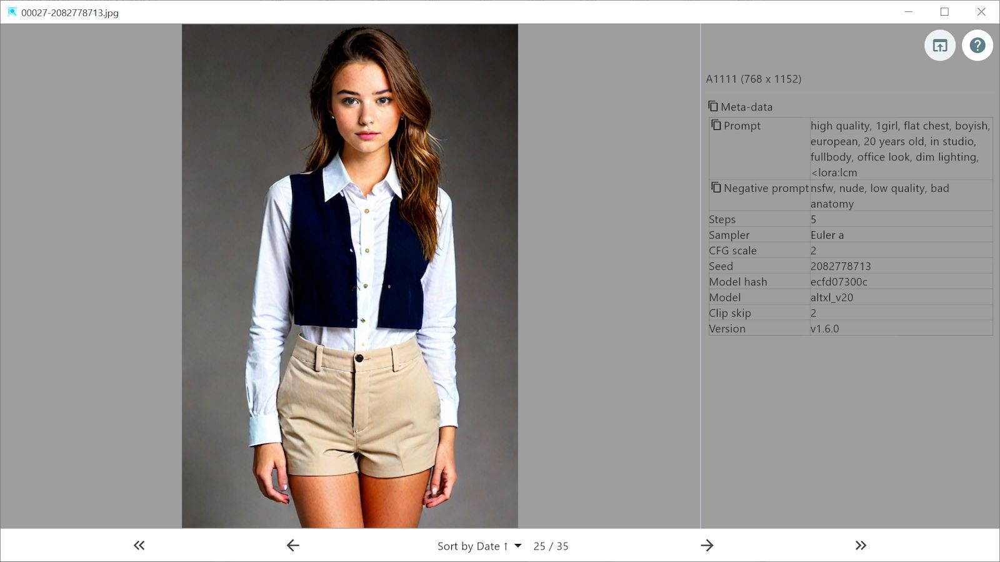
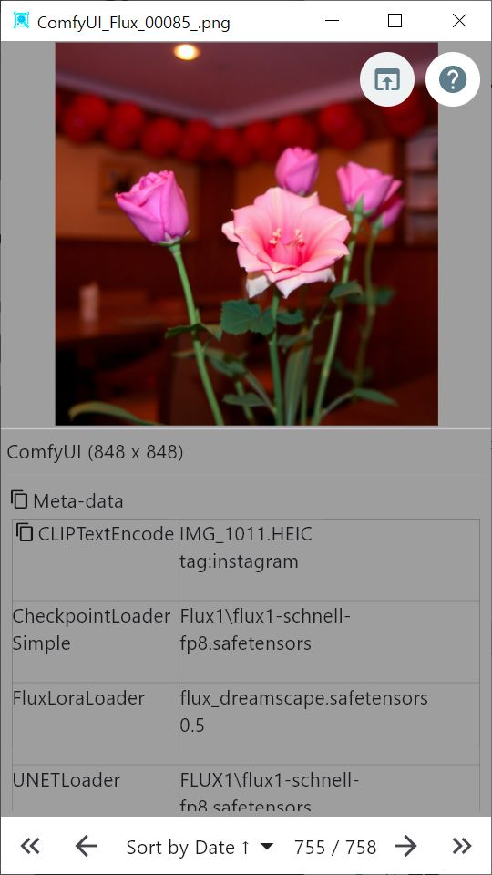

# Stable Diffusion Image Viewer

플러터로 만들어진 스테이블디퓨전 이미지 뷰어이며, 포함된 정보를 같이 보여줍니다

## 소개

이 프로그램은 이미지와 프롬프트를 포함한 정보를 보여줍니다.
정보를 보기 위해 [exiftool](https://exiftool.org)이 필요합니다

이 프로그램은 설정 및 기타 저장을 위해 Documents 디렉토리 아래에 "sdviewer-alongthecloud" 디렉토리를 생성합니다.

## 기능

* 스테이블 디퓨전으로 생성된 이미지 (png,jpg,jpeg,webp) 를 보여줍니다
* exiftool을 사용하여 프롬프트, 네거티브 프롬프트 등을 보여줍니다
* 클릭으로 프롬프트, 네거티브 프롬프트를 클립보드에 복사
* 같은 디렉토리의 이전/이후 파일로 이동할 수 있습니다. (맥에서는 디렉토리를 드래그 드랍 했을 때만 가능)
* 이미지에 Watermark 이미지를 붙여 특정 폴더(Documents 폴더 아래)에 저장할 수 있습니다
* 최초 시작 화면 추가
* 현재 파일을 탐색기 또는 파인더에서 열 수 있습니다

지원되는 생성 이미지
 - [x] A1111
 - [x] InvokeAI

자세한 것은 프로그램 내의 도움말을 보세요

## 실행, 빌드

데스크탑용으로 실행 및 빌드를 하기 위해서 플러터와 Visual Studio 또는 XCode 가 필요합니다.

1. Repository 를 clone
2. `flutter pub get` 으로 관련 라이브러리를 가져옵니다
3. `flutter run` 으로 실행합니다
4. `flutter build` 명령으로 빌드할 수 있습니다

## exiftool 설치 방법

### Windows
'앱 설치 관리자'를 사용하면 쉽게 설치할 수 있습니다

1. 만일 앱 설치 관리자가 없다면 [여기](https://www.microsoft.com/p/app-installer/9nblggh4nns1) 에서 앱 설치 관리자를 설치하세요.
2. 설치가 끝나면 명령 프롬프트 창을 띄웁니다.
3. 명령 프롬프트 창에서 ```winget install ExifTool``` 을 실행합니다. 그러면 설치 화면이 뜨면서 설치가 진행됩니다.

### Mac
당신이 만일 [brew](https://brew.sh) 를 쓰고 있다면 다음 명령으로 exiftool 을 설치할 수 있습니다

```brew install exiftool```

### 스크린샷

 

## 사용

이미지를 윈도우로 드래그 앤 드랍

1. exiftool 이 설치되어 있다면 오른쪽의 정보가 보입니다
2. 밑줄이 그어진 parameters 와 negative prompt 를 클릭하여 해당 내용을 클립보드로 복사할 수 있습니다
3. model hash를 클릭하면 civitai 로 이동합니다

맥에서는 디렉토리를 드래그 앤 드랍 했을 때만 이전 파일, 다음 파일로 이동할 수 있으며 화살표 키로 이동 가능합니다.

Windows에서는 이미지 파일을 끌어다 놓아도 이전/다음 이미지로 이동할 수 있습니다.

## 라이선스

[](LICENSE)

## 그 외

* 영어 번역을 위해 [DeepL](https://www.deepl.com/translator) 과 [ChatGPT](https://chat.openai.com) 를 사용하였습니다
